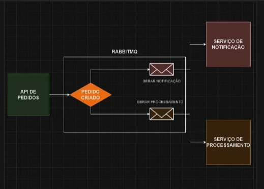

<h2>Diagrama do Projeto</h2>

<h2>Comandos para executar o projeto </h2>
docker-compose up -d

<h2>Links importantes </h2>
RabbitMq: 
http://localhost:15672/ 
MailHog: 
http://localhost:8025/ 

 
TODO
 

melhorar, adicionar a funcionalidade de mandar o email de pedido processado
