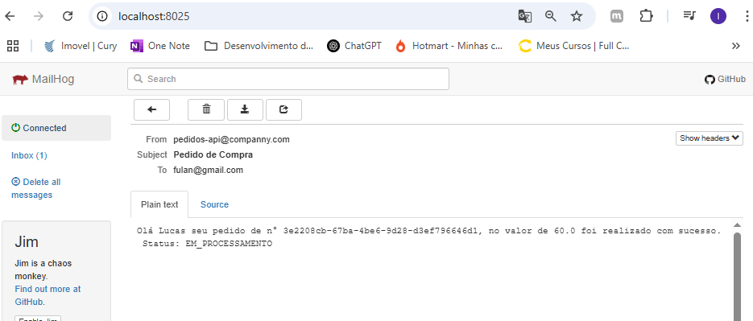

## 🗂️ Diagrama do Projeto


---


## 🚀 Comandos para Executar o Projeto

Para subir o ambiente, execute:

```bash
docker-compose up -d
```

## ✅ Ordem de Execução dos Serviços

Após subir os containers, execute os serviços na seguinte ordem:

1. **StartUp**
2. **NotificacaoApplication**
3. **ProcessadorApplication**


---

## 🔗 Links Úteis

- 🐇 **RabbitMQ**: [http://localhost:15672/](http://localhost:15672/)
- 📧 **MailHog**: [http://localhost:8025/](http://localhost:8025/)

---

## ✅ TODO


Adicionar a funcionalidade de mandar o email de pedido processado

## 🧪 Testando com Payload

```bash
curl --location 'http://localhost:8080/api/v1/pedidos' \
--header 'Content-Type: application/json' \
--data-raw '{
  "cliente": "zezinho",
  "itens": [
    {
      "produto": {
        "nome": "Fone de ouvido",
        "valor": 30.00
      },
      "quantidade": 2
    }
  ],
  "valorTotal": 60.00,
  "emailNotificacao": "fulan@gmail.com"
}'
```
